# 8-bit hex bus display board

This is a small display board which can be used to show the 8-bit
value on some bus on a 2 digit 7-segment display. The board uses an ATTINY1616
microcontroller which is dirt cheap and has 18 I/O pins. I need 9 for the display
(7x for a segment, 2x for selecting the digit) and 8 for input, so there's one
pin left which I will use to enable latching of the value if so desired.

I prototyped the thingy on a breadboard:

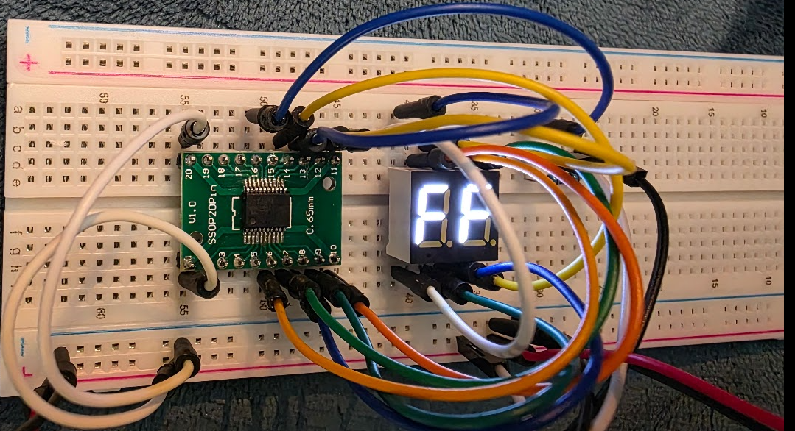

## Installing the prerequisite software (Linux/Ubuntu)

I do not use Windows (I hate and detest Microsoft) so for that you're on your own. I followed the instructions from here: [https://michael-crum.com/attiny1616/], many thanks to Michael!

Basically, you do:

```
sudo apt update
sudo apt install gcc-avr binutils-avr avr-libc gdb-avr avrdude
```
This should allow you to build the code with the usual 'make' command. This will do a build and also attempt to update the attiny using UPDI.

For that I used an USB to RS232 (5V) adapter and the following schematic:

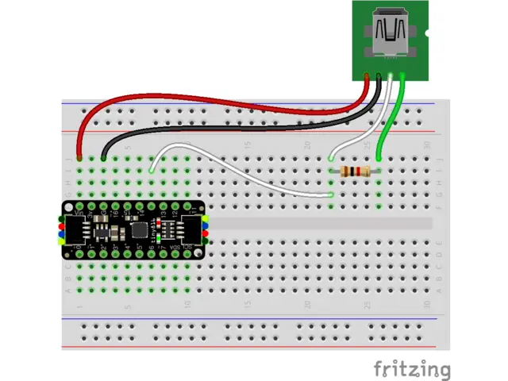

* Red and black are the 5V pins from the Serial adapter
* White is the RX pin from the serial adapter
* Green is the TX pin from the serial adapter
* The resistor is 1K.

I used the following USB-to-Serial thing:

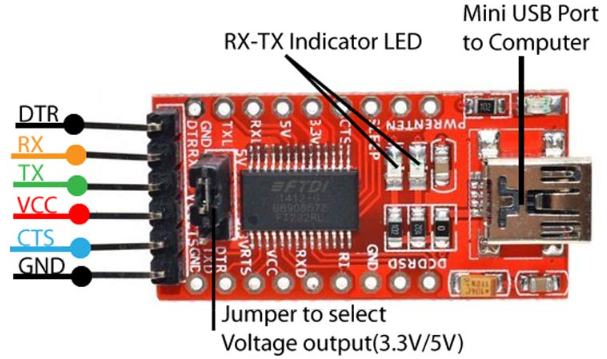

Do make sure that the jumper is set to 5V.

Once built you can test whether it can connect to the chip as follows:

```
sudo avrdude -c serialupdi -p t1616 -P "/dev/ttyUSB0" -b 57600
```
which should answer something like:
```
avrdude: AVR device initialized and ready to accept instructions
avrdude: device signature = 0x1e9421 (probably t1616)
```

## The schematic

Made in Kicad, the schematic diagram is very simple:

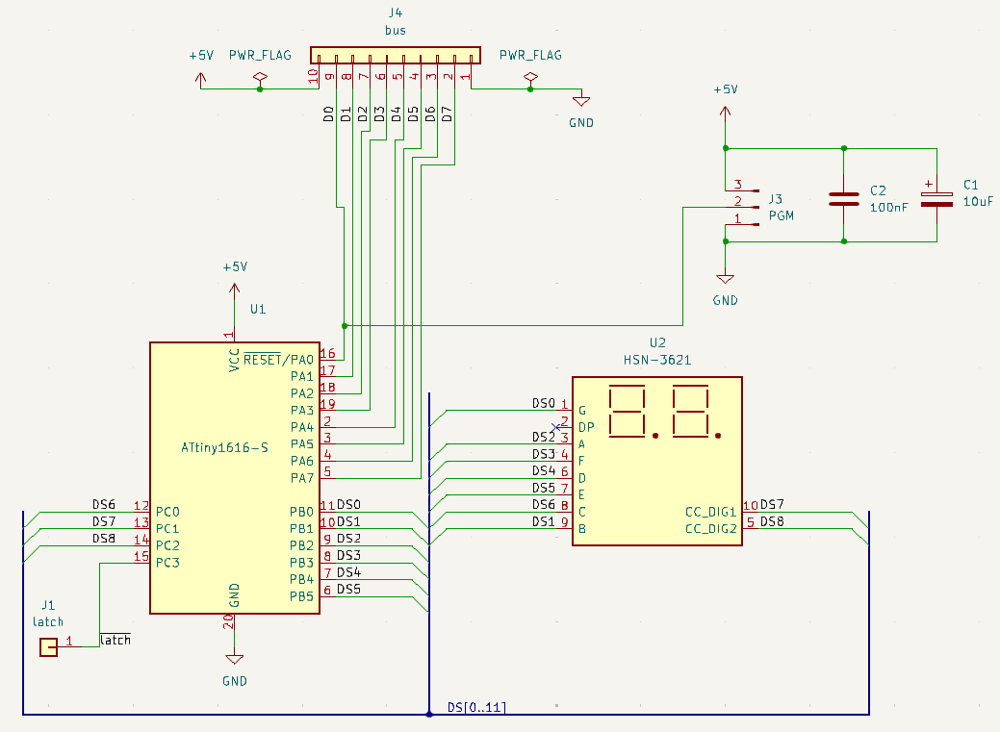

and the PCB is tiny:

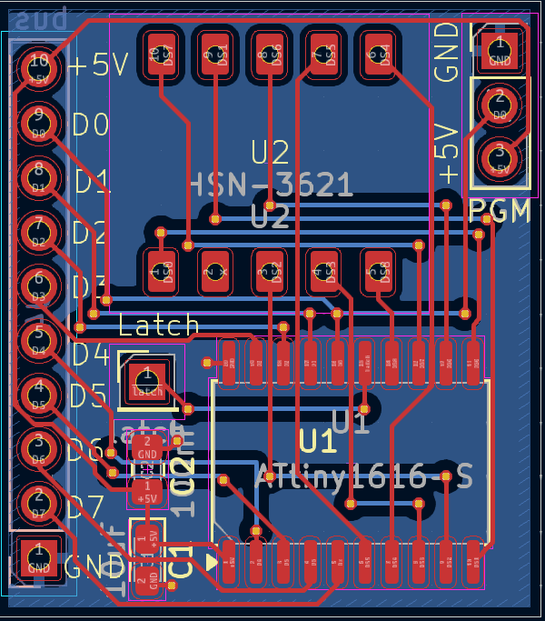

I ordered the PCBs from [PCBWay](https://pcbway.com), and they offered to send me the boards for free in return for a review. Ordering the boards is very simple through their website - just upload the zip file with gerbers from Kicad. It gets even easier if you install the PCBWay plugin inside Kicad; with that the whole generation and upload process is done by the plugin, and you are left on the PCBWay page where you can further specify your needs for the PCB:

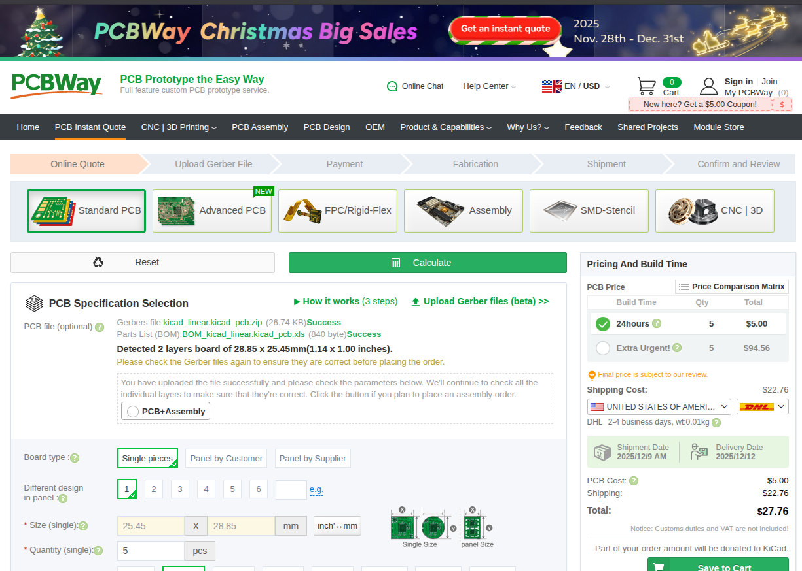

By default you get 5 boards, but you can of course change that amount to larger numbers. The price for these was $5, which is the price for most boards that do not exceed a certain size.

The boards are produced very quickly, and the process can be followed on the website which is quite nice. Most of the delay in getting them is in which kind of shipping you pick, and where you reside. I chose to pick the cheapest transport, "Global Direct Shipping" which was $4.21 for shipping to France. This made the total amount to be $10.93: $5 for the boards, $4.21 for shipping and the usual taxes. This is really cheap but of course you have to be patient because that shipping method takes a few weeks, 3 in my case. It can be a lot faster, of course, but you will pay accordingly; some of the more expensive options would let you get your boards a week after ordering.

The boards I received look really nice:

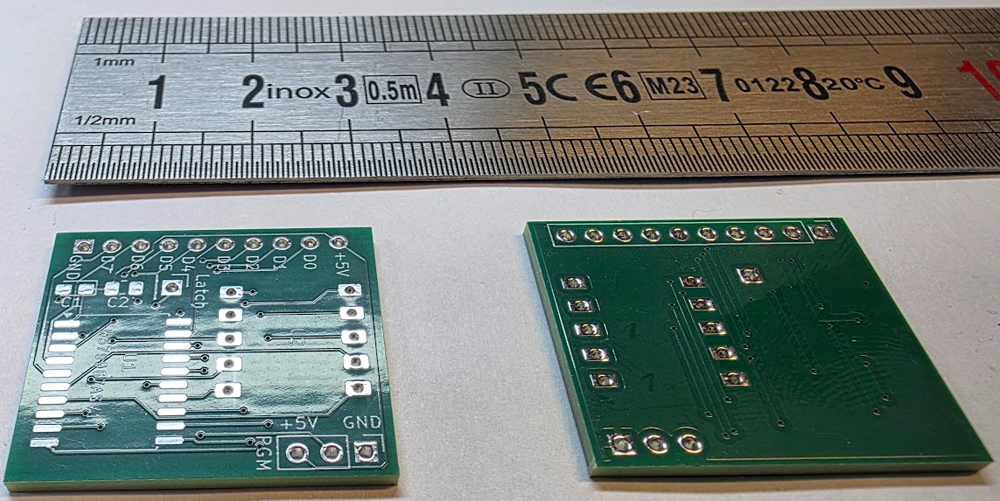

They look very clean and professional! It is amazing that you can get this for so low a price, and to have something that looks like it has been made by a professional instead of a hobbyist (well, they were of course made by a professional service, PCBWay). They also worked out of the box; the only issue I had was my own fault: the footprint of the 10uF capacitor was incorrect. I will have to change that. I worked around it by using a smaller cap. (2025/12/14 This should now be fixed on the PCB).

The components on the boards can be quite easily hand soldered. The microcontroller is quite large so with good eyes or good glasses you can easily position and solder a single corner and then align all pins correctly. Once that is done solder the other corner, check again the alignment and solder the rest. You can do this without having to do drag soldering; as long as your iron has a tip that is not too large all should be easy. You do need solder with good flux, or you need to apply some flux yourself though.

The smallest components are the two capacitors but a good set of pincers will make it easy.

Take care when soldering the pin headers; the large pin header is meant to go on the underside of the board! This is how the boards look when finished:

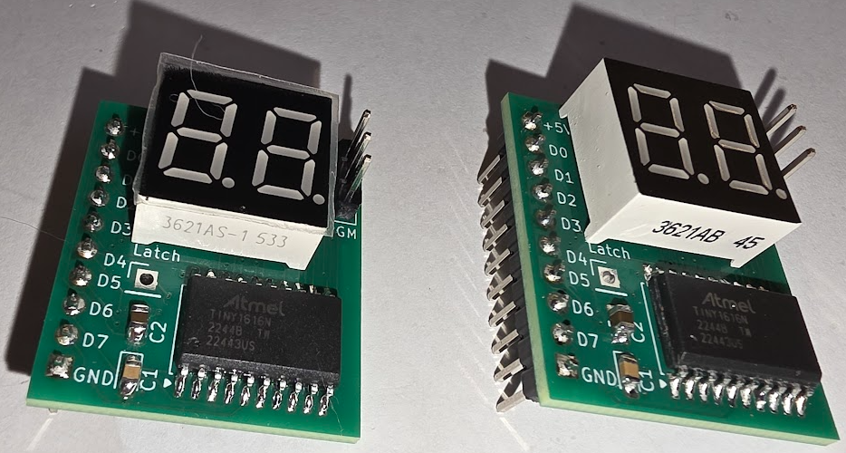

The next part is the programming part. I made a nice cable to be able to do that quickly:

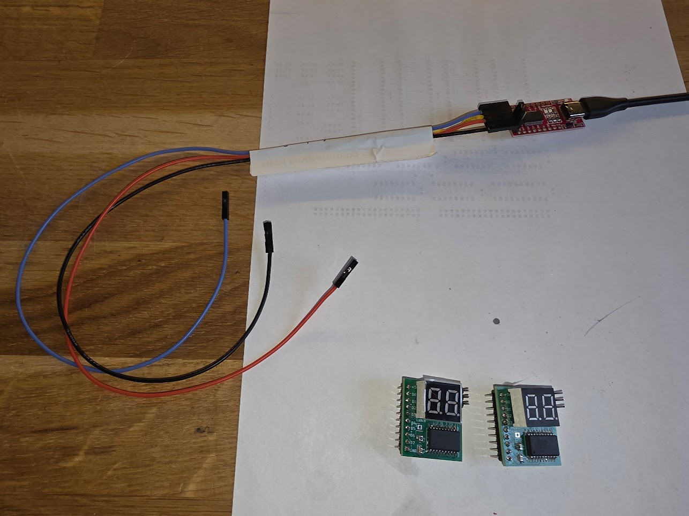

Programming requires nothing else than connecting the cable to the new board:

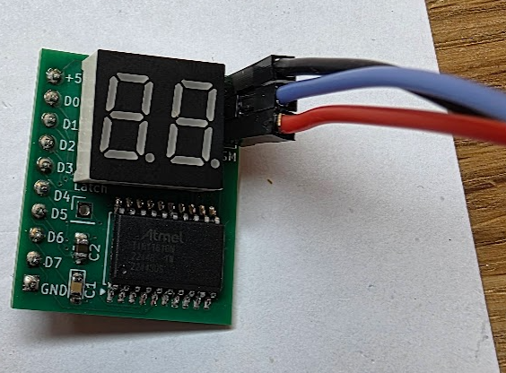

and running the make file by entering 'make' inside the directory. This does the build and after that sends it to the board:

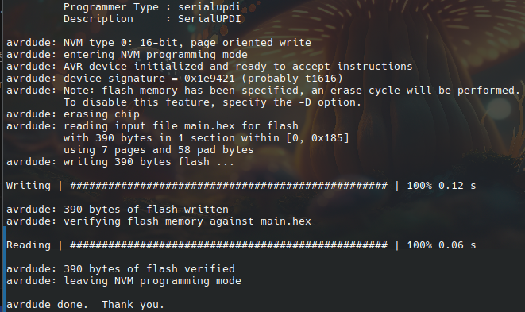

Immediately after you should see the board light up:

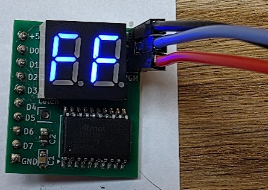

The boards are quite useful for debugging designs, I am using them with my experiment with old am2901 ALU chips:

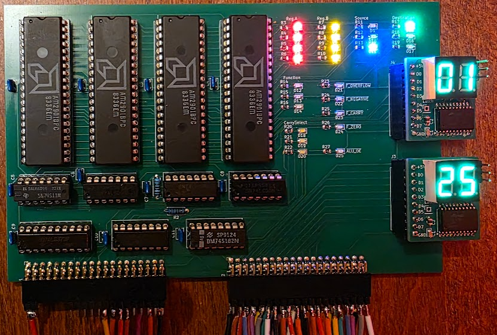

